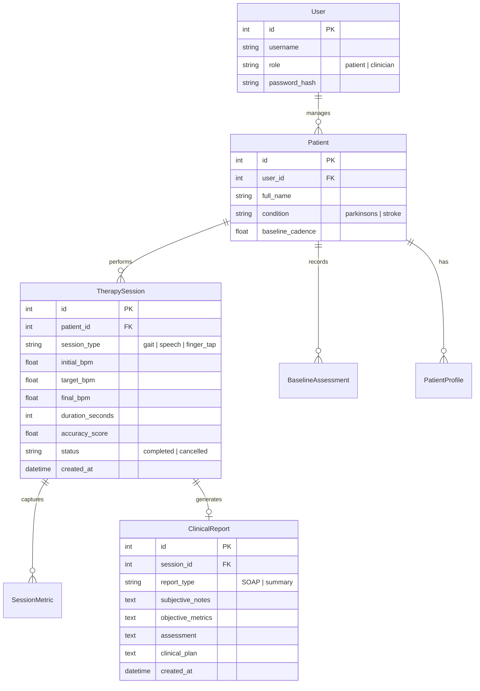

# System Architecture — NeuroBeat

## Overview
NeuroBeat is a clinical-grade, closed-loop neurological rehabilitation platform combining **Rhythmic Auditory Stimulation (RAS)**, **Edge Biomechanical Kinematics**, and a **Tri-Agent Artificial Intelligence System**.

This document outlines the detailed architectural topology, edge versus cloud compute allocation, agent collaboration, data flows, and relational database schema.

---

## 1. Architectural Topology

```
┌─────────────────────────────────────────────────────────────────────────────┐
│                       CLIENT TIER (Browser Edge Execution)                  │
├─────────────────────────────────────────────────────────────────────────────┤
│                                                                             │
│  [Hardware Inputs]                                                          │
│   ├── RGB Webcam ──► MediaPipe Pose Landmarker (60 FPS Worker)               │
│   ├── Microphone ──► Web Audio Analyser (FFT 4-Band Vocal Energy)           │
│   └── Keyboard   ──► DOM High-Res Timestamp Event Handlers (performance.now)│
│                                                                             │
│  [Edge Intelligence & Audio Synthesis]                                      │
│   ├── NuroSync Kinematic Bus (Phase Error, Asymmetry, Cadence SPM)           │
│   ├── Adaptive Controller (Phase-Locked Loop Pace Regulation)               │
│   └── Tone.js Web Audio Engine (Hardware Audio Clock Scheduling)            │
│                                                                             │
└──────────────────────────────────────┬──────────────────────────────────────┘
                                       │ HTTPS / JSON REST API
                                       ▼
┌─────────────────────────────────────────────────────────────────────────────┐
│                      APPLICATION TIER (WSGI Server)                         │
├─────────────────────────────────────────────────────────────────────────────┤
│                                                                             │
│  [Flask Application (main.py / Gunicorn Workers)]                           │
│   ├── Session State Machine (Created -> Running -> Paused -> Completed)     │
│   ├── Telemetry Ingestion & Real-Time Sync Metric Aggregator                │
│   └── Security & Authentication (Session Cookies, ProxyFix, CSRF)           │
│                                                                             │
│  [The Tri-Agent System]                                                     │
│   ├── AGENT 1: Clinical & Longitudinal Intelligence (Gemini 2.5 Flash + RAG)│
│   ├── AGENT 2: Acoustic Synthesis & Entrainment (Hugging Face + Tone.js)    │
│   └── AGENT 3: Kinematic Biomechanics & ONNX Inference (P4 Causal TCN)      │
│                                                                             │
└──────────────────────────────────────┬──────────────────────────────────────┘
                                       │ SQLAlchemy Engine / Connection Pool
                                       ▼
┌─────────────────────────────────────────────────────────────────────────────┐
│                        DATA TIER (Relational Storage)                       │
├─────────────────────────────────────────────────────────────────────────────┤
│                                                                             │
│  [SQLite Instance (neurobeat.db) / Managed Cloud PostgreSQL]                │
│   ├── users, patients, patient_profiles (Demographics & Baseline Cadence)   │
│   ├── therapy_sessions, session_metrics (Granular Biomechanical Records)    │
│   └── clinical_reports (SOAP Notes, Multi-Session Longitudinal Insights)    │
│                                                                             │
└─────────────────────────────────────────────────────────────────────────────┘
```

---

## 2. Edge vs. Cloud Compute Partitioning

To satisfy medical requirements for **zero-latency biofeedback** and **strict patient data privacy (HIPAA/GDPR)**, compute responsibilities are partitioned as follows:

| Compute Boundary | Tasks Assigned | Technical & Clinical Rationale |
| :--- | :--- | :--- |
| **Client Tier (Browser Edge)** | - MediaPipe Pose Landmark Detection<br>- Web Audio Vocal Energy FFT (100–4200 Hz)<br>- Sub-millisecond onset timestamping (`performance.now()`)<br>- Tone.js hardware-scheduled audio pulses<br>- Real-time reactive UI visualizers | **Privacy & Latency**: Raw camera feeds and raw voice audio never leave the patient's device. Processing frames locally guarantees 0ms network jitter and prevents audio-motor desynchronization. |
| **Server Tier (Cloud / Flask)** | - Session lifecycle control & authorization<br>- Telemetry persistence & aggregation<br>- Longitudinal RAG retrieval across past sessions<br>- Gemini 2.5 Flash clinical report generation<br>- Clinician cohort analytics & export | **Stateless Scaling**: Server resources are preserved for high-value business logic and LLM synthesis without wasting server GPUs on real-time video decoding. |

---

## 3. The Tri-Agent Orchestration

### Agent 1: Clinical & Longitudinal Intelligence Agent
* **Engine**: Google Gemini 2.5 Flash (`google-genai` SDK)
* **Pipeline**:
  1. Gathers finalized telemetry from `therapy_sessions` (duration, cadence SPM, sync %, timing error variance).
  2. Queries historical patient records from the past 30 days to establish longitudinal baseline trends.
  3. Formulates structured clinical **SOAP documentation** (Subjective, Objective, Assessment, Plan).
  4. Stores the generated report with metadata tags for instantaneous query delivery in patient and clinician dashboards.

### Agent 2: Generative Acoustic Synthesis & High-Reliability Entrainment Agent
* **Engine**: Hugging Face MusicGen Inference API + Tone.js Web Audio Synthesizers.
* **Failover Protocol**:
  - *Primary*: Requests dynamic AI musical rhythm tracks with prescribed rhythmic pulses and genre styling (Jazz, Ambient, Classical).
  - *Deterministic Fallback*: If network latency exceeds 1.5 seconds, or if Hugging Face returns rate limits, Tone.js synthesizers automatically take over tempo pacing with zero dropped beats.

### Agent 3: Kinematic Biomechanics & Phase Adaptation Agent
* **Engine**: Causal Multi-Scale Temporal Convolutional Network (TCN) exported to ONNX Runtime.
* **Biomechanical Pipeline**:
  - Filters noisy landmark velocities via Savitzky-Golay smoothing.
  - Computes stride asymmetry ratio ($\text{SAR} = \frac{|T_{\text{left}} - T_{\text{right}}|}{\max(T_{\text{left}}, T_{\text{right}})}$).
  - Regulates Phase-Locked Loop (PLL) to calculate next-stage tempo recommendations (+2 to +5 BPM for entrained movement, -2 to -5 BPM for freezing).

---

## 4. Database Schema & Data Models

The relational database architecture is defined in [`models.py`](file:///c:/Users/gurus/work/NITS_HACK_2026/models.py):



---

## 5. Security & Privacy Guarantees
1. **Zero Raw Media Transmission**: No camera frames or voice recordings are uploaded to the server or stored in the database. Only computed kinematic features (e.g. cadence SPM, sync offset ms) are transmitted.
2. **Session Hardening**: WSGI middleware utilizes `ProxyFix(x_proto=1, x_host=1)` to enforce secure HTTPS redirection behind load balancers.
3. **Database Segregation**: All patient records require foreign key validation against authenticated session contexts to prevent unauthorized cross-patient data access.
