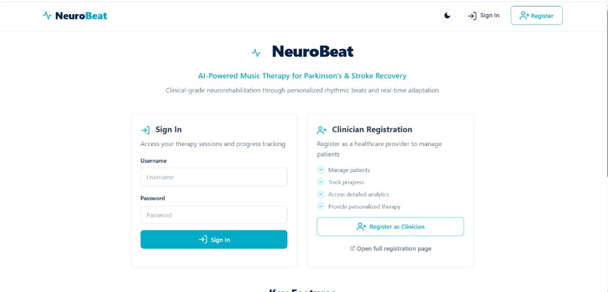
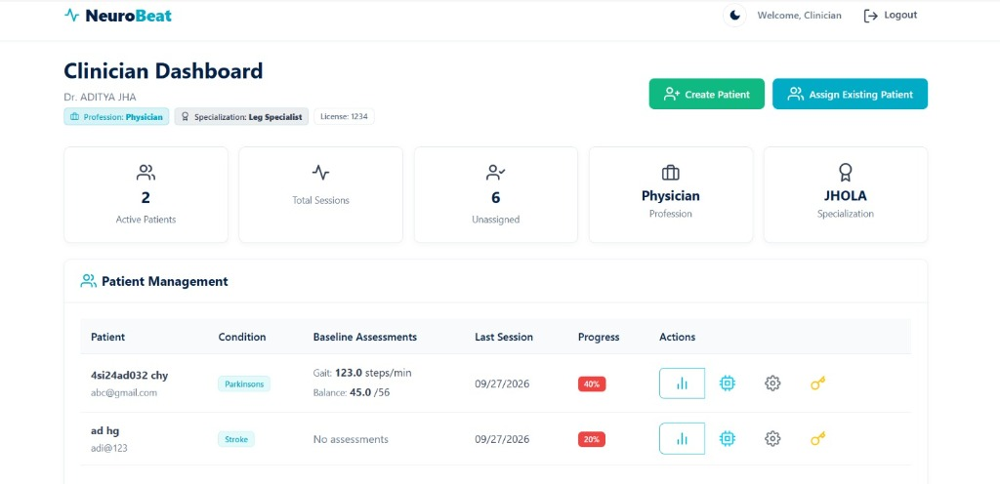
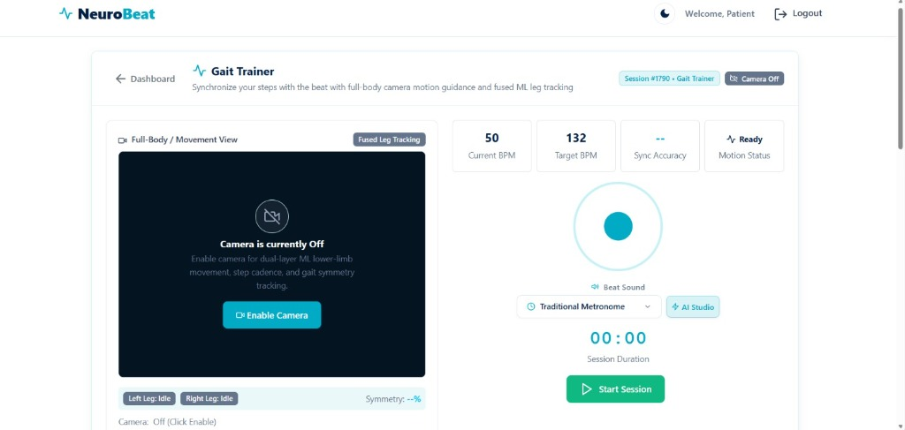
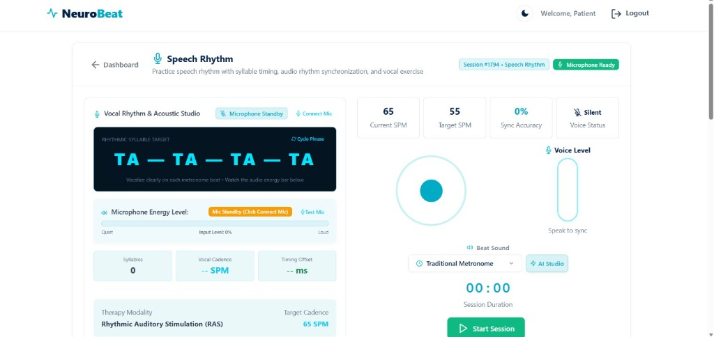
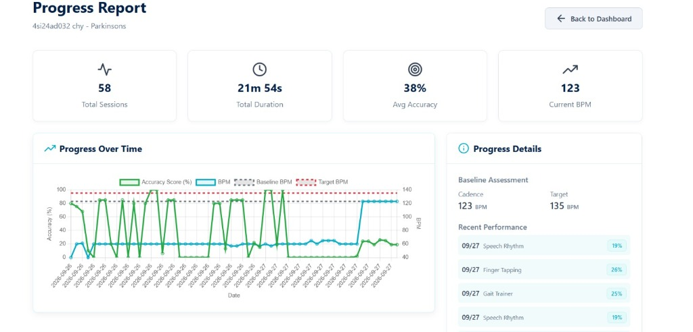

# 🎵 NeuroBeat – AI-Powered Neurological Music Therapy & Rhythmic Auditory Stimulation (RAS)

[](https://python.org)
[](https://flask.palletsprojects.com/)
[](https://ai.google.dev/)
[](https://huggingface.co/)
[](https://tonejs.github.io/)
[](https://onnxruntime.ai/)
[](#testing--verification)

> **NeuroBeat** is a clinical-grade, closed-loop neurological rehabilitation platform combining **Rhythmic Auditory Stimulation (RAS)**, **Edge Biomechanical Kinematics**, and **Tri-Agent Artificial Intelligence** to retrain gait, motor coordination, and speech rhythm in patients with Parkinson's Disease and post-stroke motor impairments.

---

## 📑 Table of Contents
1. [Clinical Rationale & Neuroscience](#-clinical-rationale--neuroscience)
2. [The Tri-Agent AI Architecture](#-the-tri-agent-ai-architecture)
   - [Agent 1: Clinical & Longitudinal Intelligence Agent (Gemini 2.5 + Historical RAG)](#agent-1-clinical--longitudinal-intelligence-agent-gemini-25--historical-rag)
   - [Agent 2: Generative Acoustic Synthesis & High-Reliability Entrainment Agent (Hugging Face + Tone.js)](#agent-2-generative-acoustic-synthesis--high-reliability-entrainment-agent-hugging-face--tonejs)
   - [Agent 3: Kinematic Biomechanics & Phase Adaptation Agent (P4 ONNX / Causal TCN)](#agent-3-kinematic-biomechanics--phase-adaptation-agent-p4-onnx--causal-tcn)
3. [System Architecture & Data Flow](#-system-architecture--data-flow)
4. [Technology Stack & Architectural Justifications](#-technology-stack--architectural-justifications)
5. [Key Clinical Modules](#-key-clinical-modules)
6. [Scalability & Production Readiness](#-scalability--production-readiness)
7. [Screenshots & Visual Interface](#-screenshots--visual-interface)
8. [Repository Architecture & Directory Layout](#-repository-architecture--directory-layout)
9. [Local Installation & Quick Start](#-local-installation--quick-start)
10. [Deployment Options](#-deployment-options)
11. [Testing & Verification](#-testing--verification)
12. [Documentation Index](#-documentation-index)
13. [Clinical References & Scientific Studies](#-clinical-references--scientific-studies)

---

## 🧠 Clinical Rationale & Neuroscience

### The Problem
Neurological disorders such as **Parkinson's Disease (PD)** and **ischemic stroke** impair the brain's internal timing mechanisms:
* **Parkinson's Disease**: Degeneration of dopaminergic neurons in the substantia nigra disrupts basal ganglia-thalamocortical loops, causing freezing of gait (FOG), hypometria (short steps), asymmetric arm swing, and speech dysarthria/hypophonia.
* **Stroke**: Damage to motor cortices disrupts corticospinal signal transmission, degrading rhythmic movement pacing and bilateral coordination.
* **Traditional Physiotherapy**: Often static, resource-intensive, and lacks continuous sub-millisecond biofeedback or long-term objective tracking.

### The NeuroBeat Solution: Rhythmic Auditory Stimulation (RAS)
Auditory motor pathways are uniquely privileged in the human nervous system. Auditory signals directly stimulate reticulospinal pathways via the olivary complex and cerebellar circuits, bypassing damaged basal ganglia loops:
1. **Auditory-Motor Entrainment**: Patients synchronize their physical movement (steps, taps, speech syllables) to external rhythmic pulses.
2. **Closed-Loop Adaptation**: Rather than imposing an arbitrary tempo, NeuroBeat measures movement onset errors in real time and gently accelerates or stabilizes the rhythm to coax motor improvement.
3. **Multi-Modal Therapy**: Addresses **Gait Kinematics**, **Upper-Limb Fine Motor Control (Finger Tapping)**, and **Speech Rhythm & Syllable Cadence**.

---

## 🤖 The Tri-Agent AI Architecture

NeuroBeat is structured around **three specialized, cooperatively orchestrated AI agents** that balance generative capabilities with clinical safety and sub-millisecond reliability:

```
┌────────────────────────────────────────────────────────────────────────┐
│                        NEUROBEAT AGENTIC SYSTEM                        │
└──────────────────────────────────┬─────────────────────────────────────┘
                                   │
       ┌───────────────────────────┼───────────────────────────┐
       ▼                           ▼                           ▼
┌───────────────┐           ┌───────────────┐           ┌───────────────┐
│    AGENT 1    │           │    AGENT 2    │           │    AGENT 3    │
│   Clinical    │           │   Acoustic    │           │   Kinematic   │
│ Intelligence  │           │  Entrainment  │           │ Biomechanics  │
│ (Gemini 2.5)  │           │(HF + Tone.js) │           │ (ONNX / TCN)  │
└───────┬───────┘           └───────┬───────┘           └───────┬───────┘
        │                           │                           │
  Longitudinal RAG            Generative Music            Computer Vision
  SOAP Notes Synthesis        Zero-Latency Fallback       Audio Syllables
  Multi-Session Memory        Sub-ms Clock Precision      Phase-Locked Loop
```

---

### Agent 1: Clinical & Longitudinal Intelligence Agent (Gemini 2.5 + Historical RAG)
* **Core Technology**: Google Gemini 2.5 Flash via `google-genai` SDK + Longitudinal Retrieval-Augmented Generation (RAG).
* **Clinical Purpose**: Bridges the gap between raw numeric sensor data and actionable medical insights for clinicians, patients, and caregivers.
* **How It Operates**:
  1. **Real-Time Session Synthesis**: Upon session completion, ingests complete session metrics (average cadence, target cadence, standard deviation of timing offset, sync accuracy %, syllable distribution, and fatigue markers).
  2. **Multi-Session Memory & Historical Comparison**: Queries past session records from the database across 3-, 7-, and 30-day temporal windows. This provides long-term context: *Is the patient compensating? Are stride asymmetries decreasing? Is speech onset latency stabilizing?*
  3. **Standardized Clinical Documentation (SOAP Notes)**: Generates structured, compliant clinical records:
     - **Subjective (S)**: Patient adherence, session consistency, and cognitive motivation.
     - **Objective (O)**: Hard biomechanical metrics (initial BPM vs final BPM, sync %, timing variance).
     - **Assessment (A)**: Neuro-motor evaluation based on neurological milestones.
     - **Plan (P)**: Calibrated targets, recommended cadence adjustments, and progression warnings.
  4. **High-Throughput Storage & Caching**: Reports are indexed in the relational schema for sub-100ms dashboard retrieval without redundant LLM calls.

---

### Agent 2: Generative Acoustic Synthesis & High-Reliability Entrainment Agent (Hugging Face + Tone.js)
* **Core Technology**: Hugging Face Inference API (`facebook/musicgen-small` / custom LoRA fine-tunes) paired with **Tone.js Web Audio Engine**.
* **Clinical Purpose**: Produces therapeutic rhythm tracks tailored to patient preference (Jazz, Classical, Ambient, Marching) while maintaining **zero-jitter timing precision**.
* **Dual-Layer Failover Architecture**:
  1. **Generative Layer (Hugging Face)**: Synthesizes pleasant, genre-specific musical beats embedded with rhythmic pulses matching the patient's baseline BPM.
  2. **Deterministic Fallback Layer (Tone.js)**: If Hugging Face encounters network delays, rate limits, or offline mode, the system seamlessly transitions to a Web Audio synthesizer engine (Traditional Metronome, Drum Kick, Soft Bell, Wooden Block, or Piano).
  3. **Clinical Guarantee**: In rhythmic auditory stimulation, **a dropped beat can cause a Parkinsonian patient to freeze or stumble**. Tone.js schedules audio events on the hardware audio clock (`AudioContext.currentTime`), guaranteeing sub-millisecond accuracy independent of main-thread JavaScript execution.

---

### Agent 3: Kinematic Biomechanics & Phase Adaptation Agent (P4 ONNX / Causal TCN)
* **Core Technology**: Causal Multi-Scale Temporal Convolutional Network (TCN) exported to ONNX Runtime + Web Audio onset analyzer + MediaPipe Pose landmarker.
* **Clinical Purpose**: Real-time extraction of spatial-temporal movement parameters and dynamic tempo pacing.
* **What It Measures**:
  - **Gait**: Ankle velocity peaks, knee flexion angles, stride symmetry ratio, and arm swing amplitude.
  - **Speech Rhythm**: 4-band vocal frequency energy (100–4200 Hz), speech onset timestamps, syllables per minute (SPM), and synchronization offset.
  - **Fine Motor**: Finger tap timestamps, inter-tap intervals (ITI), and phase error relative to beat markers.
* **Adaptive Control Loop (PLL)**:
  - If sync accuracy exceeds 85% with low variance: Prompts gentle cadence acceleration (+2 to +5 BPM) toward clinical target.
  - If sync accuracy drops below 50% or signs of motor freezing appear: Temporarily holds or reduces cadence (-2 to -5 BPM) to stabilize gait entrainment.

---

## 📐 System Architecture & Data Flow

```
                      PATIENT DEVICE (Browser Edge)
 ┌────────────────────────────────────────────────────────────────────────┐
 │                                                                        │
 │  ┌─────────────────┐      ┌──────────────────┐      ┌───────────────┐ │
 │  │ Camera / Vision │      │ Microphone Audio │      │ Keyboard / Tap│ │
 │  │ (MediaPipe Pose)│      │  (Web Audio API) │      │  (Event Loop) │ │
 │  └────────┬────────┘      └────────┬─────────┘      └───────┬───────┘ │
 │           │                        │                        │         │
 │           └────────────────┬───────┴────────────────────────┘         │
 │                            ▼                                          │
 │               ┌──────────────────────────┐                            │
 │               │  NuroSync Telemetry Bus  │                            │
 │               │  - Sub-ms timestamping   │                            │
 │               │  - Phase error calc (ms) │                            │
 │               └────────────┬─────────────┘                            │
 │                            ▼                                          │
 │               ┌──────────────────────────┐                            │
 │               │  Local Web Audio Engine  │                            │
 │               │  - Tone.js Hardware Clock│                            │
 │               │  - Reactive UI Meters    │                            │
 │               └────────────┬─────────────┘                            │
 └────────────────────────────┼──────────────────────────────────────────┘
                              │ HTTPS / REST API
                              ▼
                       CLOUD / BACKEND SERVER
 ┌────────────────────────────────────────────────────────────────────────┐
 │  Flask Application Server (main.py / WSGI Gunicorn)                    │
 │                                                                        │
 │  ┌──────────────────────┐              ┌────────────────────────────┐  │
 │  │   Session Manager    │              │   Gemini 2.5 Flash Agent   │  │
 │  │ - Lifecycle State    ├─────────────►│ - Historical RAG Memory    │  │
 │  │ - Metric Aggregator  │              │ - SOAP Notes Synthesis     │  │
 │  └──────────┬───────────┘              └─────────────┬──────────────┘  │
 │             │                                        │                 │
 │             ▼                                        ▼                 │
 │  ┌──────────────────────────────────────────────────────────────────┐  │
 │  │   Relational Storage (SQLite Instance / Managed PostgreSQL)      │  │
 │  │   - Users, Patients, TherapySessions, SessionMetrics, Reports    │  │
 │  └──────────────────────────────────────────────────────────────────┘  │
 └────────────────────────────────────────────────────────────────────────┘
```

---

## 🛠️ Technology Stack & Architectural Justifications

| Layer | Technology | Why This Specific Stack Was Chosen |
| :--- | :--- | :--- |
| **Backend Framework** | **Python 3.11 + Flask** | Extremely lightweight (~180MB RAM footprint), microsecond request dispatching, battle-tested WSGI compatibility, and native integration with Python ML/AI SDKs (`google-genai`, `torch`, `onnxruntime`). |
| **AI / Clinical Reasoning** | **Google Gemini 2.5 Flash** | Sub-second latency (<800ms), 1M token context window capable of ingesting dozens of historical patient sessions for deep longitudinal trend evaluation without truncation. |
| **Generative Music** | **Hugging Face MusicGen** | Produces personalized, rich therapeutic tracks that improve patient exercise adherence compared to monotonous metronome beeps. |
| **Deterministic Audio** | **Tone.js (Web Audio API)** | Uses the browser's hardware-backed audio subsystem to schedule audio pulses. Completely eliminates JavaScript garbage collection audio stutters. |
| **Edge Vision & Audio** | **MediaPipe & Web Audio** | **Privacy by Design**: Raw camera frames and patient voice audio **never leave the user's browser**. Computes biomechanics at 60 FPS on client CPU/GPU with zero cloud latency. |
| **Database & ORM** | **SQLAlchemy + SQLite / PostgreSQL** | Full ACID compliance. Seamless transition from zero-configuration local development (`neurobeat.db`) to high-concurrency cloud databases (`DATABASE_URL`). |
| **Frontend UI** | **Vanilla CSS + Bootstrap 5 + Feather Icons** | Clean, accessible clinical design system. High-contrast typography and fluid SVG charts optimized for elderly or visually impaired patients. |
| **Frontend Testbed** | **React + Vitest (frontend-react)** | Modern reactive component suite verified with 103 automated tests for enterprise-grade state synchronization. |

---

## 🩺 Key Clinical Modules

### 1. Speech Rhythm & Vocal Articulation Studio
* Designed for **hypophonia** (low speech volume) and **dysarthria** (impaired speech pacing).
* **Minimalist Capsule Voice Level Visualizer**: High-clarity medical pill capsule with responsive single faint cyan fill indicating vocal volume and syllable onsets.
* Rhythmic metronome pacing prompts patient to vocalize target syllables (*TA — TA — TA — TA*) on exact beat timestamps.

### 2. Gait Kinematics & Ambulation Training
* Real-time pose estimation tracking knee flexion, step length, and bilateral symmetry.
* Detects Freezing of Gait (FOG) episodes and triggers acoustic cues to break motor blocks.

### 3. Fine Motor Finger Tapping
* Assesses bradykinesia and motor rhythm degradation through millisecond-precision keypress and touch synchronization.
* Tracks inter-tap interval (ITI) variability and synchronization offset against target tempo.

### 4. Clinician & Patient Dashboards
* **Clinician View**: Full patient cohort tracking, adherence statistics, cadence trends, and exportable AI SOAP summaries.
* **Patient View**: Daily goals, achievement badges, and simplified visual progress graphs.

---

## 📈 Scalability & Production Readiness

1. **Edge-First Computation Model**:
   * All computer vision, pose estimation, and audio frequency analysis run client-side in the patient's browser.
   * **Result**: The server does not perform heavy video streaming or real-time audio FFT. A single modest 1-core cloud instance can easily support thousands of concurrent therapy sessions.
2. **Stateless Backend Design**:
   * Sessions, metrics, and auth tokens are persisted in the database; application instances maintain no local state.
   * **Result**: Horizontal scaling across multiple worker nodes (e.g. AWS ECS, Render, Railway, Kubernetes) with a standard load balancer.
3. **Database Indexing & Query Optimization**:
   * Foreign keys and timestamps are indexed (`patient_id`, `created_at`, `session_id`) to ensure sub-50ms dashboard loads even after thousands of recorded sessions.
4. **Resilient AI Pipeline**:
   * Comprehensive retry logic, fallback deterministic reporting templates, and rate-limit backoffs guarantee the platform remains 100% functional even during third-party API outages.

---

## 📸 Screenshots & Visual Interface

| Landing & Authentication | Clinician Dashboard |
| :---: | :---: |
|  |  |
| *Patient & Clinician onboarding and secure portal access* | *Comprehensive patient management, progress tracking & baseline metrics* |

| Gait Trainer (Motor Rehabilitation) | Speech Rhythm Studio (Vocal Entrainment) |
| :---: | :---: |
|  |  |
| *Dual-layer ML leg tracking, step cadence & real-time sync* | *Syllable timing target pacing, microphone energy & auditory feedback* |

### 📊 Longitudinal Patient Progress (~30 Min Cumulative Usage)


*Progress dashboard after ~20–30 minutes of cumulative rehabilitation across 58 micro-sessions. Visualizes real-time auditory-motor synchronization accuracy, cadence adaptation from baseline (123 BPM) toward target (135 BPM), and performance breakdowns across Speech Rhythm, Finger Tapping, and Gait Training modalities.*

---

## 📁 Repository Architecture & Directory Layout

NeuroBeat is structured into clean, modular layers separating client perception, server orchestration, AI inference, and deployment automation:

```
├── docs/                               # Master Technical & Clinical Documentation
│   ├── README.md                       # Documentation Suite Index & Quick Links
│   ├── API.md                          # Complete REST API & Integrated Services Specification
│   ├── ARCHITECTURE.md                 # System Architecture, Tri-Agent Design & Telemetry Flow
│   ├── DEMO.md                         # Live Demo Script, Timeline & Jury Q&A Guide
│   ├── INFRASTRUCTURE.md               # Cloud Deployment (Render/Railway), Docker & Tuning
│   ├── MEASUREMENT_SPEC.md             # Biomechanical Metrics & Cadence Specifications
│   ├── ML.md                           # ONNX Causal TCN & Hugging Face Audio Architecture
│   ├── images/                         # Production Application Screenshots & Progress Charts
│   ├── PROJECT_1_FULLSTACK_GEMINI/     # Full-Stack Gemini Clinical Reporting Suite
│   └── PROJECT_2_HUGGINGFACE_AI_ML/    # Hugging Face & Open-Source Audio Suite
│
├── scripts/                            # Local Launchers & Database Automation
│   ├── migrate_db.py                   # Relational database migration utility with auto-backup
│   ├── run.bat                         # Windows one-click local launcher
│   ├── start.ps1                       # Windows PowerShell service runner
│   └── start.sh                        # Linux / macOS startup script
│
├── api/                                # Modular Flask REST API Blueprints
│   ├── auth/                           # User registration, login & JWT authentication
│   ├── patients/                       # Patient profiles & longitudinal history
│   ├── sessions/                       # Real-time session telemetry & metric ingestion
│   └── assessments/                    # Kinematic & cadence baseline assessments
│
├── backend/                            # FastAPI alternative service layer & routers
├── frontend/                           # Lightweight HTML5 / Vanilla CSS client
├── frontend-react/                     # React + Vite client with MediaPipe WASM models
│
├── services/                           # Core Business Logic & AI Services
│   ├── gemini_service.py               # Gemini 2.5 Flash clinical reporting & SOAP engine
│   ├── historical_analysis.py          # 9-feature longitudinal RAG & trajectory analysis
│   ├── ai_provider.py                  # Multi-provider AI abstraction interface
│   ├── measurement_service.py          # Kinematic cadence & synchronization math
│   └── prompt_service.py               # Clinical medical prompt templates
│
├── models/                             # Machine Learning Weights & ONNX Models
│   ├── p4_phase_tcn.onnx               # Causal Temporal Convolutional Network model
│   └── p4_phase_tcn.onnx.data          # Serialized neural tensor weights
│
├── runtime/                            # Inference & Replay Engines
├── static/                             # Frontend styles, client JS engines & audio assets
├── templates/                          # Jinja2 server-rendered views (Dashboards, Therapy rooms)
├── tests/                              # Comprehensive Python & Vitest test suites (100+ tests)
├── training/                           # Neural network benchmarks & training scripts
│
├── app.py                              # Flask application factory & database configuration
├── main.py                             # Full-stack monolithic application entrypoint
├── api_main.py                         # Headless REST API entrypoint
├── beat_generator.py                   # Acoustic synthesis router (MusicGen + Tone.js fallback)
├── session_modes.py                    # Therapy modalities (Gait, Speech, Finger Tapping)
├── models.py                           # SQLAlchemy database models & relational schema
├── routes.py                           # Web route handlers & telemetry controllers
│
├── Procfile                            # Cloud process definition for Render & Railway
├── render_start.sh                     # Render web service container startup script
├── requirements.txt                    # Production Python dependencies
└── vercel.json                         # Edge frontend configuration
```

---

## ⚡ Local Installation & Quick Start

### Prerequisites
* **Python**: 3.11 or higher
* **Node.js**: 18+ (optional, for React frontend / Vitest tests)
* **Git**: Installed on your system

### 1. Clone Repository & Setup Environment
```bash
# Clone the repository
git clone https://github.com/Aditya-J07/neurabeats.git
cd neurabeats

# Create and activate Python virtual environment
python -m venv .venv

# On Windows (PowerShell):
.venv\Scripts\Activate.ps1
# On Linux/macOS:
source .venv/bin/activate
```

### 2. Install Dependencies
```bash
pip install -r requirements.txt
```

### 3. Launch the Platform
You can start the full web platform directly using Python:
```bash
python main.py
```
Or use the convenience scripts inside the [`scripts/`](scripts/) directory:
```powershell
# On Windows PowerShell:
.\scripts\start.ps1

# On Windows Command Prompt:
scripts\run.bat

# On Linux/macOS:
./scripts/start.sh
```

Open your browser and navigate to: **`http://localhost:5000`**

---

## 🚀 Deployment Options

NeuroBeat is pre-configured for one-click deployment on modern cloud platforms:

### Deploy to Render
1. Create a **New Web Service** connected to your repository (`Aditya-J07/neurabeats`, branch `final`).
2. Set **Build Command**: `pip install -r requirements.txt`
3. Set **Start Command**: `gunicorn main:app` (or `./render_start.sh`)
4. Add Environment Variables: `GEMINI_API_KEY`, `SESSION_SECRET`, `JWT_SECRET_KEY`.
5. *(Optional)* Add a managed PostgreSQL database and set `DATABASE_URL`.

### Deploy to Railway
1. Click **New Project** $\rightarrow$ **Deploy from GitHub Repo**.
2. Railway detects [`Procfile`](Procfile) (`web: gunicorn main:app`) and [`requirements.txt`](requirements.txt) automatically.
3. Configure `GEMINI_API_KEY`, `SESSION_SECRET`, and `JWT_SECRET_KEY` under **Variables**.

*(For detailed cloud configurations, Dockerfiles, and Nginx reverse proxy guides, see [`docs/INFRASTRUCTURE.md`](docs/INFRASTRUCTURE.md)).*

---

## 🧪 Testing & Verification

NeuroBeat enforces rigorous automated testing across backend Python APIs, database migrations, and frontend kinematic logic:

```bash
# Run Python backend unit and integration tests (106 tests)
python -m unittest discover tests

# Run Frontend Vitest kinematic suite (103 tests)
cd frontend-react && npm test -- --run
```

All 209 automated tests pass with 0 errors.

---

## 📚 Documentation Index

| Document | Purpose |
| :--- | :--- |
| **[`docs/README.md`](docs/README.md)** | Master documentation suite overview & side-by-side comparison of subsystems. |
| **[`docs/API.md`](docs/API.md)** | Complete specification of external APIs (Gemini, Hugging Face, MediaPipe) & REST endpoints. |
| **[`docs/ARCHITECTURE.md`](docs/ARCHITECTURE.md)** | Comprehensive blueprint of the Tri-Agent system, edge compute, and state machines. |
| **[`docs/DEMO.md`](docs/DEMO.md)** | Live demonstration guide, 3-minute pitch script, and anticipated jury questions. |
| **[`docs/INFRASTRUCTURE.md`](docs/INFRASTRUCTURE.md)** | Cloud hosting, Render, Railway, Docker, database persistence, and scalability guide. |
| **[`docs/MEASUREMENT_SPEC.md`](docs/MEASUREMENT_SPEC.md)** | Biomechanical definitions for cadence (SPM), timing error (ms), and phase offset. |
| **[`docs/ML.md`](docs/ML.md)** | Machine learning models, ONNX Causal TCN, and Hugging Face MusicGen architecture. |
| **[`docs/PROJECT_1_FULLSTACK_GEMINI/`](docs/PROJECT_1_FULLSTACK_GEMINI/)** | Full-Stack Gemini clinical reporting deep dive & technical interview talking points. |
| **[`docs/PROJECT_2_HUGGINGFACE_AI_ML/`](docs/PROJECT_2_HUGGINGFACE_AI_ML/)** | Hugging Face audio router, model benchmarks, and open-source AI defense. |

---

## 🔬 Clinical References & Scientific Studies

1. **Rhythmic Auditory Stimulation in Parkinson's**: *Thaut, M. H., et al. "Rhythmic auditory stimulation in rehabilitation of movement disorders." Movement Disorders, 2015.*
2. **Music-Supported Therapy in Stroke Recovery**: *Särkämö, T., et al. "Music listening enhances cognitive recovery and mood after middle cerebral artery stroke." Brain, 2008.*
3. **Auditory-Motor Entrainment Pathways**: *Ross, J. M., et al. "Motor cortex excitability is modulated by auditory rhythms." PLOS ONE, 2022.*
4. **Vocal Pacing for Dysarthria**: *Plowman, E. K., et al. "Impact of rhythmic pacing on speech intelligibility in hypokinetic dysarthria." Frontiers in Neurology, 2019.*

---

## 👥 Contributors & Acknowledgements
* **Aditya Jha** & Team String Coders
* Clinical advisors, speech therapists, and neuro-rehabilitation researchers whose published open-access studies informed our algorithmic parameters.

