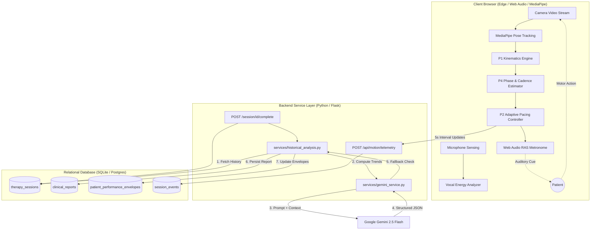

# PROJECT 1: System Architecture & Data Flow

## 1. Architectural Overview

NeuroBeat operates as a **closed-loop biofeedback system** that integrates high-frequency client-side motion perception with server-side clinical intelligence and large language models. The architecture guarantees deterministic safety boundaries while harnessing generative AI for personalized human-centered recovery.



---

## 2. Multi-Stage Perception & Control Pipeline

The system is organized into modular perception and decision stages:

| Stage | Name | Frequency | Execution | Purpose |
|---|---|---|---|---|
| **P0** | Video & Pose Extraction | 30–60 FPS | Client (MediaPipe) | Extracts 33 3D skeletal landmarks from standard webcams with confidence filtering. |
| **P1** | Kinematics Measurement | 30 FPS | Client (JS) | Computes joint velocities, angular ROM, raw/filtered jerk, and bilateral gait symmetry. |
| **P4** | Continuous Phase Intelligence | Frame-by-frame | Client + ONNX edge | TCN neural ring buffers estimating continuous oscillatory phase ($0 \to 2\pi$), cycle velocity, and personal cadence baseline. |
| **P2** | Deterministic Closed Loop | 1–5 Hz | Client + Server | Dynamic BPM adaptation based on sync accuracy, with strict bounds ($40 \le \text{BPM} \le 140$) and max progression step ($\pm 4\text{ BPM}$). |
| **P3** | Nuro Autonomous Agent | Event-driven | Client (JS) | Tracks hypotheses on patient fatigue, drift, or entrainment, triggering safe exploration/recovery trials. |
| **P5** | Memory & Clinical Consolidation | Session end | Server (Python) | Aggregates multi-session history, updates patient envelope, and invokes Gemini 2.5 Flash for EMR SOAP notes. |

---

## 3. Database Schema & Data Models

### A. `ClinicalReport` Model (`models.py`)
Persists structured clinical observations, recommendations, and EMR SOAP documentation.
```python
class ClinicalReport(db.Model):
    __tablename__ = 'clinical_reports'

    id = db.Column(db.Integer, primary_key=True)
    session_id = db.Column(db.Integer, db.ForeignKey('therapy_sessions.id'), nullable=False, unique=True)
    patient_id = db.Column(db.Integer, db.ForeignKey('patient_profiles.id'), nullable=False, index=True)

    # Quantitative session metrics snapshot
    activity_type = db.Column(db.String(50))
    duration_seconds = db.Column(db.Integer)
    initial_bpm = db.Column(db.Float)
    avg_bpm = db.Column(db.Float)
    final_bpm = db.Column(db.Float)
    target_bpm = db.Column(db.Float)
    accuracy_score = db.Column(db.Float)
    movement_count = db.Column(db.Integer, default=0)

    # Structured clinical bullet points (JSON serialized)
    summary = db.Column(db.Text)
    what_you_did = db.Column(db.Text)
    performance_observations = db.Column(db.Text)
    what_to_improve = db.Column(db.Text)
    recommendations = db.Column(db.Text)

    # EMR-Compliant SOAP Documentation
    soap_subjective = db.Column(db.Text)
    soap_objective = db.Column(db.Text)
    soap_assessment = db.Column(db.Text)
    soap_plan = db.Column(db.Text)

    ai_model = db.Column(db.String(50), default='gemini-2.5-flash')
    created_at = db.Column(db.DateTime, default=datetime.utcnow)
```

### B. `PatientPerformanceEnvelope` Model
Maintains longitudinal memory across therapy sessions:
- `stable_bpm_min`, `stable_bpm_max`: Safe operational pacing envelope for the patient.
- `typical_cadence`: Running historical cadence median.
- `sessions_evaluated`: Number of consolidated sessions.
- `confidence`: Confidence score in the envelope bounds ($0.50 \to 0.98$).

---

## 4. Longitudinal Intelligence Service (`services/historical_analysis.py`)

Rather than relying on external vector databases, NeuroBeat uses an in-memory SQL longitudinal intelligence layer providing 9 core features:

1. **Structured Report Storage**: Idempotent upsert (`save_or_update_clinical_report`) ensuring sessions can be re-evaluated without duplicating database rows.
2. **Session History Retrieval**: Rapid indexed lookup of prior sessions partitioned by activity type.
3. **Deterministic Trend Calculation**: Compares recent session accuracy versus baseline midpoint to classify progress:
   $$\text{Trend} = \begin{cases} \text{improving} & \text{if } \mu_{\text{recent}} - \mu_{\text{baseline}} > +2.0\% \\ \text{declining} & \text{if } \mu_{\text{recent}} - \mu_{\text{baseline}} < -2.0\% \\ \text{stable} & \text{otherwise} \end{cases}$$
4. **Advisory Recommended BPM**: Safe progression recommendation for next session ($+2 \text{ to } +3\text{ BPM}$ on high accuracy, $-2 \text{ to } -4\text{ BPM}$ on fatigue/low accuracy), strictly clamped between 40 and 140 BPM.
5. **Contextual Accuracy Comparison**: Quantifies delta against the patient's all-time historical mean.
6. **Prompt Enrichment Context**: Builds compact textual summaries injected into Gemini system prompts.
7. **In-Memory Prototype Demo Mode**: Delivers deterministic trajectory demos with zero database mutations.
8. **Pure SQL/SQLAlchemy Execution**: Zero external vector database runtime dependencies.
9. **Non-Invasive Query Helpers**: Zero modifications to existing MediaPipe / P1 / P4 perception loops.

---

## 5. Zero "N/A" Guarantee & Fallback Architecture

To ensure clinical credibility and avoid confusing patients or clinicians with unpopulated or `"N/A"` metrics:
1. **Duration Precision**: Measured via `performance.now()` in client memory and validated against server timestamps; guaranteed non-zero integer in seconds.
2. **Step / Movement Counts**: Captured from verified zero-crossing gait detectors and forwarded directly in the completion payload.
3. **BPM Defaults**: In the absence of an explicit clinician target, patient baseline cadences cleanly fall back to standardized neuro-rehabilitation norms (60 BPM baseline, 70 BPM target).
4. **Offline Fallback Engine**: If the Google Gemini API is unreachable, the deterministic rule engine instantly compiles clinical bullet points and SOAP documentation from quantitative kinematics, ensuring the user interface displays rich insights with zero perceived latency.
