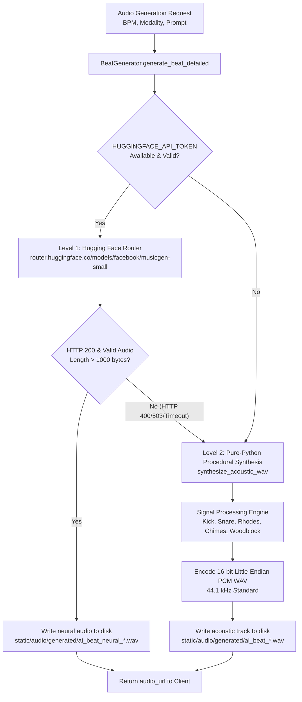

# PROJECT 2: Dual-Engine Audio Architecture & Mathematical Synthesis

## 1. Dual-Engine Architecture Overview

NeuroHugging pairs cloud-based autoregressive neural audio generation with deterministic client/server acoustic sound design:

---

## 2. Mathematical Signal Processing Specifications

All procedural instruments in `beat_generator.py` are computed using pure mathematical functions without external audio libraries (`numpy`, `scipy`, or `librosa` are NOT required).

### A. Acoustic Kick Drum Synthesis
A physical kick drum skin starts vibrating at a high initial frequency and drops exponentially to its resonant cavity pitch while decaying in amplitude:

$$\text{Frequency Sweep: } f(t) = f_{\text{base}} + \Delta f \cdot e^{-\lambda_f t} = 48 + 87 e^{-34t} \quad (\text{Hz})$$

$$\text{Instantaneous Phase: } \phi(t) = 2\pi \int_0^t f(\tau) d\tau = 2\pi \left( 48t + \frac{87}{34} (1 - e^{-34t}) \right)$$

$$\text{Amplitude Envelope: } A(t) = A_0 \cdot e^{-\lambda_A t} = 0.85 \cdot e^{-26t}$$

$$\text{Audio Signal: } s_{\text{kick}}(t) = A(t) \cdot \sin(\phi(t))$$

### B. Acoustic Snare & Rimshot Synthesis
The snare combines a physical wooden body resonance ($210\text{ Hz}$) with high-frequency white noise from the metal snares under the bottom head:

$$s_{\text{snare}}(t) = 0.40 e^{-30t} \sin(2\pi \cdot 210 \cdot t) + 0.50 e^{-22t} \cdot \mathcal{N}(0, 1)$$

Where $\mathcal{N}(0, 1)$ is uniform pseudo-random white noise bounded in $[-1.0, 1.0]$.

### C. Lo-Fi Rhodes Electric Piano (Jazz Chords)
The Rhodes piano sound is produced by an array of struck metal tines. We simulate 4-voice extended chords across a classic 4-bar cadence:

$$\text{Progressions: } C^{\text{maj7}} (261.63, 329.63, 392.00, 493.88\text{ Hz}) \to A^{\text{m7}} \to D^{\text{m7}} \to G^7$$

For each chord frequency $f_i$, we sum the fundamental and its soft second harmonic:

$$s_{\text{voice}}(t, f_i) = \left( \sin(2\pi f_i t) + 0.28 \sin(4\pi f_i t) \right) \cdot 0.25 e^{-2.2t}$$

$$s_{\text{piano}}(t) = \sum_{i=1}^4 s_{\text{voice}}(t, f_i)$$

### D. Solfeggio Crystal Chimes (432 Hz & 528 Hz)
Crystal chimes vibrate in inharmonic modes with non-integer partial multiples:

$$\text{Partials } k = [1.0, 2.76, 5.40, 8.93]$$

$$\text{Amplitudes } A_k = [0.45, 0.25, 0.15, 0.08]$$

$$s_{\text{chime}}(t, f_{\text{solfeggio}}) = e^{-1.6t} \sum_{k} A_k \sin(2\pi \cdot k \cdot f_{\text{solfeggio}} \cdot t)$$

Tuned between 528 Hz (the "transformation and DNA repair" Solfeggio frequency) and 432 Hz (mathematical natural tuning).

### E. Resonant Metronome Woodblock
High-Q bandpass impulse modeling hardwood percussion:
- **Downbeat (Accent)**: $f_0 = 1120\text{ Hz}, \quad A(t) = 0.85 e^{-42t}$
- **Offbeat (Pulse)**: $f_0 = 820\text{ Hz}, \quad A(t) = 0.65 e^{-46t}$

---

## 3. WAV PCM File Format Specification

The generated WAV files adhere to the standard RIFF/WAVE 16-bit linear PCM format:

| Field | Value | Specification |
|---|---|---|
| **ChunkID** | `"RIFF"` | Resource Interchange File Format header |
| **Format** | `"WAVE"` | Audio file format |
| **Subchunk1ID** | `"fmt "` | Format subchunk marker |
| **AudioFormat** | `1` | Linear PCM (uncompressed) |
| **NumChannels** | `1` (Mono) | Optimized for rhythmic pulse precision |
| **SampleRate** | `44100 Hz` | Compact Disc quality standard |
| **ByteRate** | `88200 bytes/sec` | $\text{SampleRate} \times \text{NumChannels} \times \frac{\text{BitsPerSample}}{8}$ |
| **BlockAlign** | `2 bytes` | $\text{NumChannels} \times \frac{\text{BitsPerSample}}{8}$ |
| **BitsPerSample**| `16 bits` | $-32768 \le \text{sample} \le 32767$ little-endian signed integer (`<h`) |

### Normalization & Anti-Clipping Guarantee
Before encoding into 16-bit integers, the entire signal array is scanned for peak absolute amplitude:
$$\text{norm\_factor} = \begin{cases} \frac{0.85}{\max |s|} & \text{if } \max |s| > 0.85 \\ 1.0 & \text{otherwise} \end{cases}$$
Every sample is scaled and clamped:
$$\text{sample}_{16} = \text{int}\left( \max(-32767, \min(32767, s \cdot \text{norm\_factor} \cdot 32767)) \right)$$
This guarantees **zero digital clipping distortion** even with complex layered polyphonic chords.
